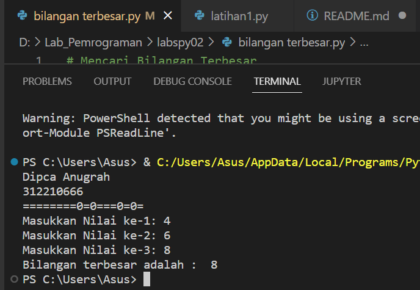

#labspy02
**Dipca Anugrah**
**312210666**
# langkah pembuatan program menginput 3 bilangan dan mencari nilai terbesar dari bilangan tersebut
1. Buatlah program untuk menginputkan 3 buah bilangan bertipe data integer atau bilangan bulat:
bilangan 1, bilangan 2, dan bilangan 3 dengan menggunakan variabel a,b dan c.
variabel a bertipe integer (input("Masukkan bilangan ke-1: "))
variabel b bertipe integer (input("Masukkan bilangan ke-2: "))
variabel c bertipe   int (input("Masukkan bilangan ke-3: "))
2. lalu buat statment if untuk mencari bilangan terbesar dari 3 bilangan yang di inputkan tersebut dengan cara:
 - jika bilangan a lebih besar dari bilangan b dan c , maka variabel d (variabel untuk menyimpan 
 bilangan terbesar) adalah variabel a, tetapi
 - jika bilangan a lebih kecil dari bilangan b dan c , maka varibel d adalah variabel b, tetapi 
 - jika bilangan c lebih besar dari bilangan b maka varibel d = variabel c
3. menampilkan bilangan terbesarnya dengan cara memanggil variabel d :
jadi bilangan terbesar nya adalah variabel d

# flowchart programnya
.png)

# cara dan hasil dari programnya adalah :

